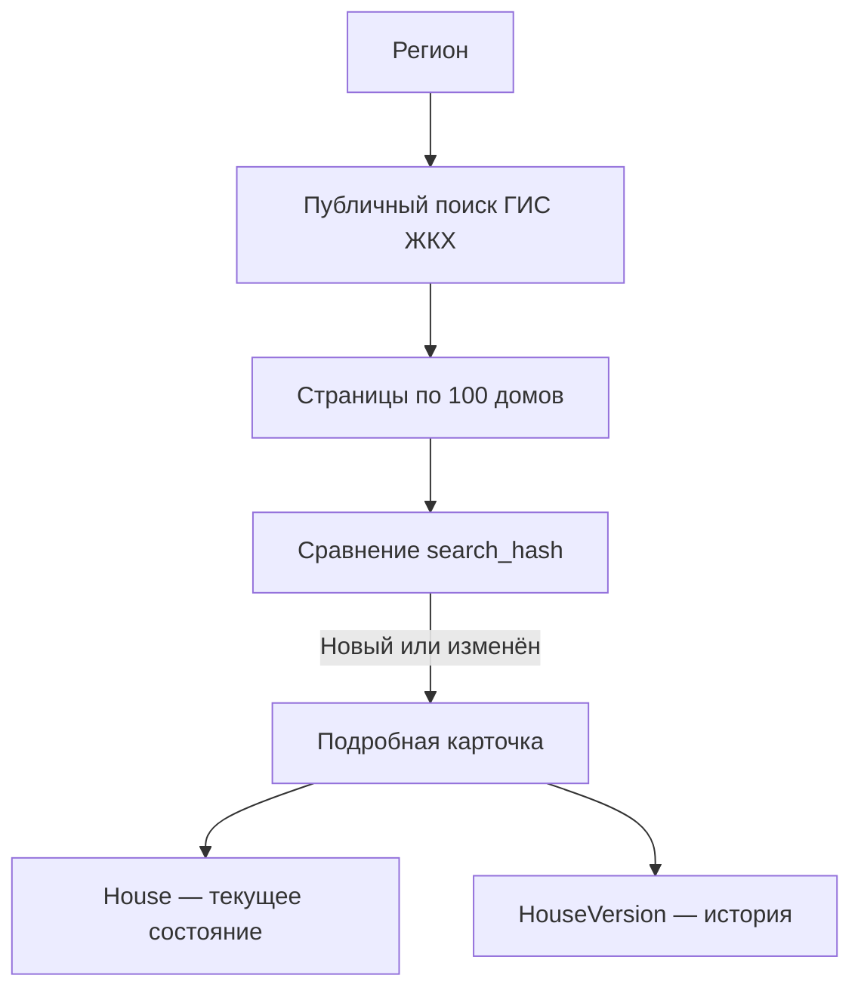

# Housing Registry — открытый реестр жилищного фонда России

`housing-registry` — открытое Django-приложение для сбора, сопоставления и анализа
публичных данных о многоквартирных домах, способах управления и управляющих
организациях в субъектах Российской Федерации.

Первая версия предоставляет административную панель Django, хранит актуальное
состояние объектов и фиксирует историю изменений. Пилотный запуск проводится на
данных Ярославской области, но модель и команды рассчитаны на последовательное
подключение любых регионов России.

> Проект является независимым и не относится к ГИС ЖКХ, Минстрою России или
> порталу Госуслуг. Данные источников могут содержать ошибки и требуют проверки.

## Возможности первой версии

- постраничная загрузка публичного поиска ГИС ЖКХ, до 100 домов за запрос;
- получение подробной карточки по ссылке «Сведения об объекте жилищного фонда»;
- хранение адресов, площадей, типа и состояния дома;
- отдельное поле «Способ управления»;
- сведения об управляющей организации, ТСЖ, ТСН, ЖСК или ЖК;
- история версий только при фактическом изменении данных;
- журнал каждого запуска и ошибок;
- безопасная синхронизация отдельно по каждому региону;
- заготовка для реестра назначенных администрацией управляющих организаций.

## Технологии

- Python 3.12;
- Django 5.2;
- PostgreSQL;
- `httpx` для запросов к публичному API;
- Gunicorn и systemd для развёртывания на виртуальной машине.

SQLite используется только для локальной разработки и тестов.

## Схема данных

| Модель | Назначение |
|---|---|
| `Region` | Субъект РФ: код, наименование и GUID ФИАС; включает или выключает синхронизацию |
| `House` | Текущее состояние дома, регион, адрес, площади, способ управления и организация |
| `Organization` | УО, ТСЖ, ТСН, ЖСК, ЖК и другие организации |
| `HouseVersion` | Снимок изменившихся данных дома и перечень изменённых полей |
| `ImportRun` | Журнал запуска по региону: параметры, результаты и ошибки |
| `AdministrativeAppointment` | Решение администрации о назначении временной УО |

Значения `House.management_method`:

- `uo` — управляющая организация;
- `hoa_cooperative` — ТСЖ/ТСН/ЖСК/ЖК;
- `direct` — непосредственное управление;
- `unknown` — не установлено.

Поле `uo_selection_method` хранит `owners`, `municipality` или `unknown`.
Отсутствие дома в реестре назначенных УО не считается доказательством выбора УО
собственниками.

## Как работает синхронизация



Используемые публичные endpoints:

```text
POST /homemanagement/api/rest/services/houses/public/searchByAddress
GET  /homemanagement/api/rest/services/houses/public/{typeCode}/{guid}
```

`calcCount=true` передаётся только для первой страницы. Подробные карточки
запрашиваются для новых или изменившихся домов, либо по отдельному расписанию.

При авторитетной синхронизации отсутствующие дома учитываются только внутри
выбранного региона. Один пропуск не деактивирует дом: по умолчанию требуется два
последовательных полных успешных запуска.

## Локальный запуск

Сначала создайте локальный файл настроек:

```bash
cp .env.example .env
```

Перед запуском замените заглушки `DJANGO_SECRET_KEY` и `PGPASSWORD` в `.env`
на два разных случайных значения. `.env` исключён из Git; публикуйте только
`.env.example`. Django завершится с понятной ошибкой, если ключ не задан.

### Docker Compose

Compose автоматически читает `.env`. Используется встроенное описание сборки
из `docker-compose.yml`; статические файлы собираются при запуске контейнера.
Локальный `.env` в образ не копируется. Нужен Docker Compose 2.17 или новее.

```bash
docker compose up --build -d
docker compose exec web python manage.py createsuperuser
```

Админка: <http://127.0.0.1:8000/admin/>

### Python

```bash
python3.12 -m venv .venv
source .venv/bin/activate
pip install -r requirements.txt
set -a
source .env
set +a
export DB_ENGINE=sqlite
python manage.py migrate
python manage.py createsuperuser
python manage.py runserver
```

## Настройка региона

Регион можно создать в Django Admin или командой:

```bash
python manage.py configure_region \
  --code 76 \
  --name "Ярославская область" \
  --fias-guid a84b2ef4-db03-474b-b552-6229e801ae9b \
  --federal-district "Центральный федеральный округ"
```

Для другого субъекта РФ укажите его код, наименование и GUID ФИАС. Синхронизация
регионов выполняется раздельно, чтобы сбой или неполная выдача одного субъекта не
влияли на остальные.

## Проверочная и полная загрузка

Сначала загрузите одну страницу:

```bash
python manage.py sync_gis_houses \
  --region-code 76 \
  --page-size 100 \
  --max-pages 1
```

После проверки результата в админке:

```bash
python manage.py sync_gis_houses --region-code 76 --page-size 100 --authoritative
python manage.py sync_gis_details --region-code 76 --mode pending --sleep 0.25
```

Если сервер возвращает меньше записей, чем запрошено, команда останавливается,
чтобы не создать незаметный пропуск данных.

### Режимы загрузки карточек

```bash
python manage.py sync_gis_details --region-code 76 --mode pending
python manage.py sync_gis_details --region-code 76 --mode missing
python manage.py sync_gis_details --region-code 76 --mode stale --stale-days 90
python manage.py sync_gis_details --region-code 76 --mode all
python manage.py sync_gis_details --guid 7c5711a3-17bc-4c84-8eb8-37f651970b56
```

Для диагностики можно добавить `--limit 10`.

## Фильтры способов управления

Команда принимает точный справочный объект, полученный из сетевого запроса
интерфейса ГИС ЖКХ:

```bash
python manage.py sync_gis_houses \
  --region-code 76 \
  --management-type-ref-json '{"guid":"...","code":"...","houseManagementTypeName":"ТСЖ"}' \
  --forced-management-method hoa_cooperative
```

Фильтрованную выборку нельзя запускать с `--authoritative`, поскольку она не
содержит все дома региона.

## PostgreSQL в Yandex Cloud

Рекомендуемая схема:

1. Managed Service for PostgreSQL и ВМ находятся в одной облачной сети.
2. Для приложения создаются отдельные БД и пользователь.
3. PostgreSQL доступен только из security group ВМ приложения.
4. Подключение использует TLS и корневой сертификат Yandex Cloud.
5. Django Admin дополнительно ограничивается VPN или списком доверенных IP.

Если `.env` ещё не создан, выполните `cp .env.example .env`. Замените заглушки
секретов, укажите параметры облачной БД и TLS (`PGSSLMODE=verify-full`,
`PGSSLROOTCERT` — путь к корневому сертификату), затем выполните:

```bash
source .venv/bin/activate
set -a
source .env
set +a
python manage.py migrate
python manage.py createsuperuser
python manage.py collectstatic --noinput
```

Примеры unit-файлов находятся в `deploy/systemd/`.

## Проверки

```bash
pip install -r requirements-dev.txt
set -a
source .env
set +a
export DB_ENGINE=sqlite
python manage.py check
python manage.py test
ruff check .
ruff format --check .
```

## Правила работы с данными

- не добавляйте в репозиторий пароли, токены, `.env` и дампы БД;
- не публикуйте персональные данные из помещений или лицевых счетов;
- большие архивы и исходные CSV не хранятся в Git;
- соблюдайте разумную частоту запросов и условия использования источника;
- сохраняйте исходный JSON для аудита, но отделяйте его от нормализованных полей;
- выводы для управленческих или юридических решений проверяйте по первоисточнику.

## План развития

1. Пилотная синхронизация Ярославской области.
2. Подключение остальных субъектов РФ.
3. Импорт реестров лицензий и назначенных администрациями УО.
4. Сопоставление сведений о контрагентах с официальными открытыми источниками.
5. Отчёты о структуре рынка по домам и площади.
6. REST API, пользовательский web-интерфейс и инструменты ИИ-агента.

## Участие в проекте

Предложения, сообщения об ошибках и pull request приветствуются. Перед началом
работы ознакомьтесь с [CONTRIBUTING.md](CONTRIBUTING.md).

Проект распространяется по лицензии Apache License 2.0.
